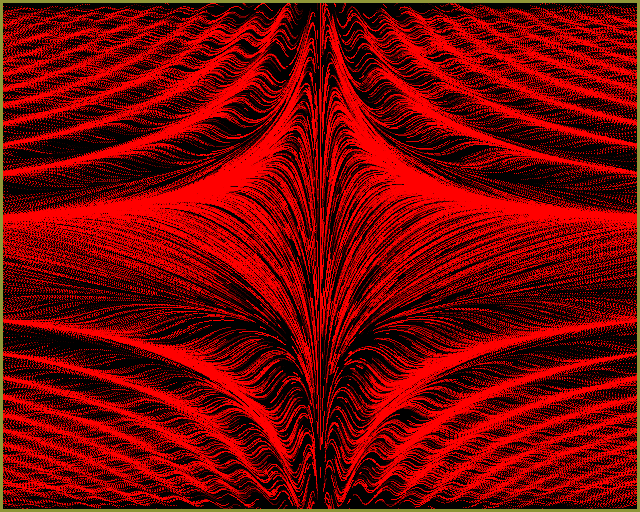
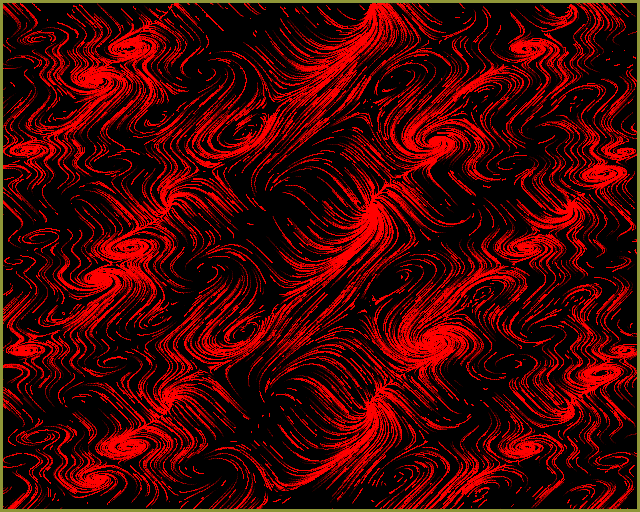
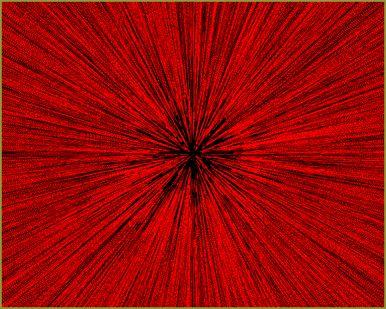
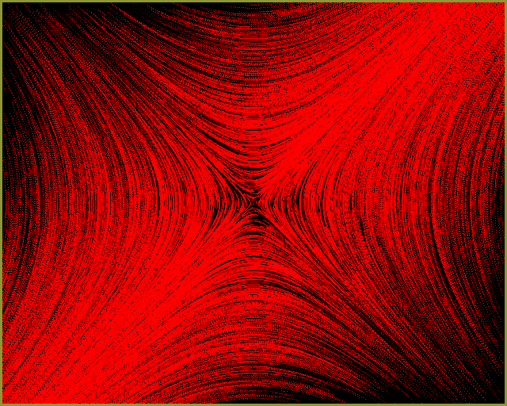

# computicle

This application visualizes 2D vector fields by showing the movement of particles placed on the plane. All relevant computation (i.e. integrating the field definition function for each particle using classical Runge-Kutta) is implemented on the GPU using GLSL compute shaders.

